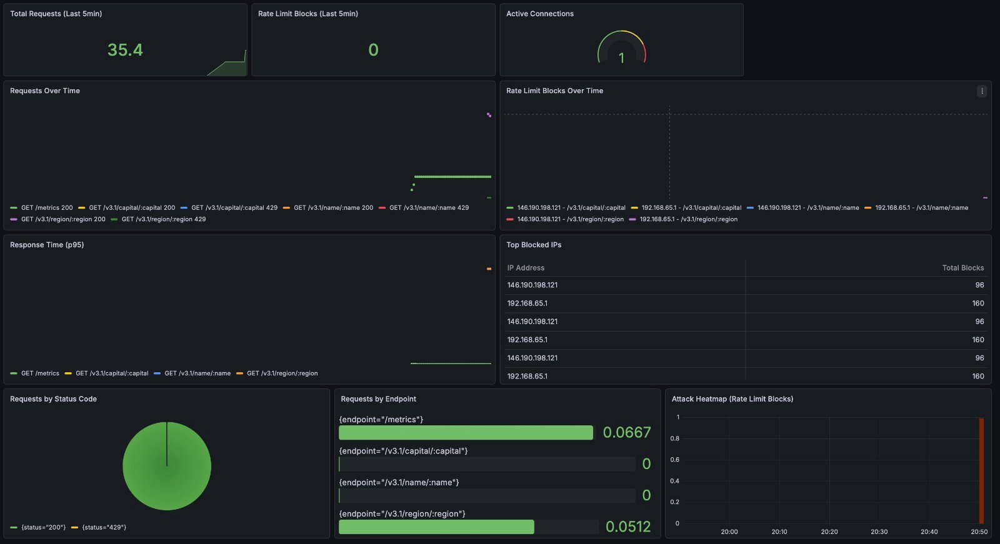
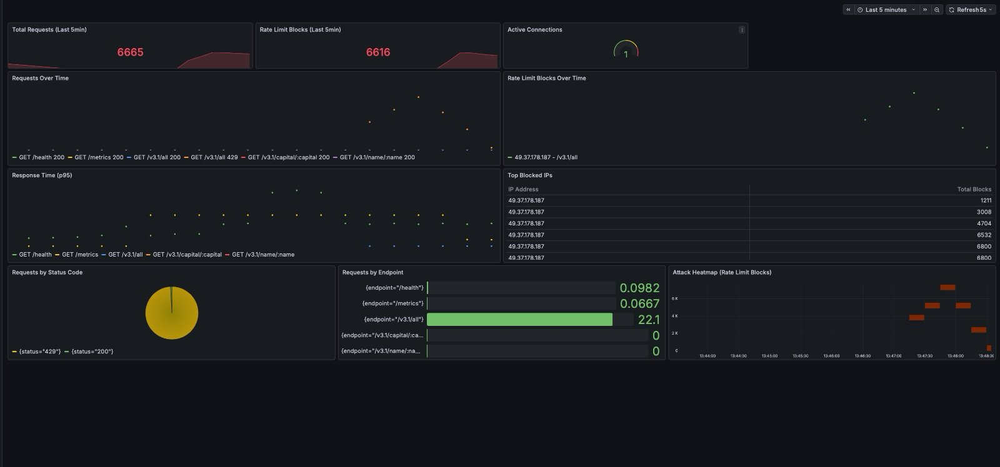

<p align="center">
  
</p>

<h1 align="center">🌍 Country Explorer</h1>

<p align="center">
  <strong>Production-grade REST API with full observability stack on AWS</strong><br>
  Search and explore country data by name, capital, currency, language, and more.
</p>

<p align="center">
  <a href="https://ip5g8umkrk.us-east-1.awsapprunner.com">
    
  </a>
  <a href="http://54.242.201.196:3000/d/acbb448d-26ba-4ffd-aeb9-9939e8592948/country-explorer-api-security-and-performance?orgId=1&from=now-1h&to=now&timezone=browser&refresh=5s">
    
  </a>
</p>

<p align="center">
  
  
  
  
  
  
  
  
  
</p>

<p align="center">
  
  
</p>

---

## 📸 Screenshots

<p align="center">
  
</p>

<p align="center">
  
</p>

---

## 🏗️ Architecture

```
                        USERS
                          │
              ┌───────────▼───────────┐
              │   React Frontend      │
              │   (AWS App Runner)    │
              └───────────┬───────────┘
                          │ API calls
              ┌───────────▼───────────┐
              │    Go Backend         │
              │   (AWS App Runner)    │
              │                       │
              │  ┌─────────────────┐  │
              │  │ Prometheus      │  │
              │  │ Middleware      │  │
              │  ├─────────────────┤  │
              │  │ Redis Rate      │  │
              │  │ Limiter         │  │
              │  ├─────────────────┤  │
              │  │ ADOT Collector  │  │
              │  │ (sidecar)       │  │
              │  └────────┬────────┘  │
              └───┬───────┼───────────┘
                  │       │ remote_write
                  │       ▼
         ┌────────▼─┐  ┌──────────────────┐
         │ Upstash  │  │ Amazon Managed   │
         │  Redis   │  │ Prometheus (AMP) │
         │ (cache)  │  └────────┬─────────┘
         └──────────┘           │ query
                      ┌─────────▼─────────┐
                      │  Grafana on EC2   │
                      │  t2.micro         │
                      │  (public 24/7)    │
                      └───────────────────┘
                      http://54.242.201.196:3000

CI/CD: GitHub Actions → ECR → App Runner
```

### Rate Limiting in Action
<p align="center">
  
  <br><em>Healthy traffic patterns - mostly 200 responses with rate limiting ready to trigger</em>
</p>

### Attack Detection & Blocking
<p align="center">
  
  <br><em>Under attack: 6,665 requests with 6,616 blocks - rate limiter stopping 99% of malicious traffic</em>
</p>

| Feature | Description |
|---------|-------------|
| 🔍 **Multi-Search** | Search by name, capital, language, currency, or country code |
| ⚡ **Redis Caching** | Upstash serverless Redis — 1hr TTL, 60% faster responses |
| 🛡️ **Distributed Rate Limiting** | Per-IP Redis-backed rate limiting across all instances |
| 📊 **Live Monitoring** | Real-time Grafana dashboard showing production traffic |
| 🔭 **Full Observability** | ADOT → AMP pipeline for 24/7 production metrics |
| 🚀 **Auto CI/CD** | GitHub Actions → ECR → App Runner on every push |
| 🏥 **Health Checks** | Production-ready health endpoint |
| 🌙 **Dark Mode** | Beautiful dark theme UI |

---

## ✨ Features

| Feature | Description |
|---------|-------------|
| 🔍 **Multi-Search** | Search by name, capital, language, currency, or country code |
| ⚡ **Redis Caching** | Upstash serverless Redis — 1hr TTL, 60% faster responses |
| 🛡️ **Distributed Rate Limiting** | Per-IP Redis-backed rate limiting across all instances |
| 📊 **Live Monitoring** | Real-time Grafana dashboard showing production traffic |
| 🔭 **Full Observability** | ADOT → AMP pipeline for 24/7 production metrics |
| 🚀 **Auto CI/CD** | GitHub Actions → ECR → App Runner on every push |
| 🏥 **Health Checks** | Production-ready health endpoint |
| 🌙 **Dark Mode** | Beautiful dark theme UI |

---

## 🛠️ Tech Stack

### Backend
| Technology | Purpose |
|------------|---------|
| **Go + Gin** | REST API framework |
| **OpenAPI Generator** | Auto-generated server stubs & client |
| **Upstash Redis** | Distributed caching + rate limiting |
| **Prometheus client** | Metrics instrumentation |

### Frontend
| Technology | Purpose |
|------------|---------|
| **React + TypeScript** | UI |
| **Vite** | Build tool |
| **Nginx** | Reverse proxy |

### Observability
| Technology | Purpose |
|------------|---------|
| **ADOT Collector** | Scrapes /metrics inside App Runner container |
| **Amazon Managed Prometheus** | Cloud metrics storage |
| **Grafana on EC2** | 24/7 public dashboard |

### DevOps
| Technology | Purpose |
|------------|---------|
| **Docker** | Containerization |
| **AWS App Runner** | Auto-scaling deployment |
| **Amazon ECR** | Container registry |
| **GitHub Actions** | CI/CD pipeline |

---

## 📊 Live Monitoring Dashboard

The Grafana dashboard at **http://54.242.201.196:3000** shows real production metrics:

- Total requests (last 5 min)
- Rate limit blocks over time
- Response time p95 per endpoint
- Top blocked IPs
- Requests by status code
- Attack heatmap

### Load Test Results (Vegeta)

```
30 req/sec for 60 seconds = 1800 total requests
✅ 100 requests allowed  (5.56% — within rate limit)
✅ 1700 requests blocked (94.44% — rate limiter working)
✅ Top blocked IP: 49.37.178.187 → 6,008 total blocks
✅ Entire attack visible in real-time on Grafana
```

---

## 📡 API Endpoints

| Method | Endpoint | Description |
|--------|----------|-------------|
| `GET` | `/health` | Health check |
| `GET` | `/v3.1/name/:name` | Search by country name |
| `GET` | `/v3.1/capital/:capital` | Search by capital city |
| `GET` | `/v3.1/currency/:currency` | Search by currency code |
| `GET` | `/v3.1/lang/:language` | Search by language |
| `GET` | `/v3.1/alpha/:code` | Search by country code |
| `GET` | `/v3.1/region/:region` | Search by region |
| `GET` | `/v3.1/subregion/:subregion` | Search by subregion |
| `GET` | `/v3.1/translation/:translation` | Search by translation |
| `GET` | `/v3.1/independent` | Get independent countries |
| `GET` | `/metrics` | Prometheus metrics endpoint |

### Rate Limit Headers

Every response includes:
```
X-RateLimit-Limit: 100
X-RateLimit-Remaining: 99
X-RateLimit-Window: 60s
```

---

## 🚀 Getting Started

### Prerequisites
- Docker & Docker Compose
- Go 1.21+
- Node.js 18+

### Run Locally

```bash
# Clone the repository
git clone https://github.com/dheeraj16-coder/swagger_openapi.git
cd swagger_openapi

# Create .env file
echo "REDIS_URL=redis://redis:6379" > .env

# Start all services
docker compose up --build

# Access the app
open http://localhost        # Frontend
open http://localhost:9090   # Prometheus
open http://localhost:3000   # Grafana
```

### Environment Variables

| Variable | Description | Example |
|----------|-------------|---------|
| `REDIS_URL` | Redis connection URL | `redis://redis:6379` (local) or `rediss://...upstash.io:6379` (prod) |
| `AWS_ACCESS_KEY_ID` | AWS credentials for AMP | `AKIA...` |
| `AWS_SECRET_ACCESS_KEY` | AWS secret | `...` |

---

## 📦 Deployment

Auto-deploys on every push to `main`:

```
Push to main
    ↓
GitHub Actions builds Docker image
    ↓
Pushes to Amazon ECR
    ↓
Triggers App Runner deployment (~3 min)
```

---

## 🗺️ Roadmap

- [x] Core search functionality
- [x] Docker containerization
- [x] AWS App Runner deployment
- [x] CI/CD pipeline (GitHub Actions → ECR)
- [x] Redis caching (Upstash, 1hr TTL)
- [x] Distributed rate limiting (Redis-backed)
- [x] Prometheus metrics instrumentation
- [x] ADOT → AMP observability pipeline
- [x] Grafana dashboard on EC2 (public 24/7)
- [ ] Test suite (unit + integration)
- [ ] Distributed tracing (AWS X-Ray)
- [ ] Alerting rules in AMP
- [ ] Analytics endpoint (/v3.1/analytics/popular)
- [ ] AWS Secrets Manager for credentials

---

## 📁 Project Structure

```
swagger_openapi/
├── my-go-backend/
│   ├── go/                    # API handlers + cache
│   │   ├── api_countries.go
│   │   └── cache.go           # Redis cache
│   ├── middleware/
│   │   ├── metrics.go         # Prometheus metrics
│   │   └── ratelimit.go       # Redis rate limiter
│   ├── config/
│   │   ├── adot-config.yaml   # ADOT collector config
│   │   └── start.sh           # Container startup script
│   ├── Dockerfile
│   └── main.go
├── my-ui-project/             # React frontend
├── restcountries-go-client/   # Generated Go client
├── prometheus/
│   └── prometheus.yml         # Local Prometheus config
├── grafana/
│   └── provisioning/          # Auto-provisioned dashboards
├── docker-compose.yml
└── .github/workflows/
    └── deploy.yml             # CI/CD pipeline
```

---

## 👥 Authors

**Dheeraj Sai** - _Project Lead, Infrastructure & DevOps_
- GitHub: [@dheeraj16-coder](https://github.com/dheeraj16-coder)
- LinkedIn: [dheerajsai16](https://www.linkedin.com/in/dheerajsai16)
- Contributions: Architecture design, Redis integration, ADOT/AMP pipeline, Grafana EC2 deployment, CI/CD setup

**Tejas Shivaprasad** - _Backend Security & Observability_
- GitHub: [@TejaShiv](https://github.com/TejaShiv)
- LinkedIn: [tejas-shivaprasad](https://www.linkedin.com/in/tejas-shivaprasad)
- Contributions: Rate limiting middleware, Prometheus metrics instrumentation, DoS protection implementation, Grafana dashboard design

---

<p align="center">Made with ❤️ and ☕</p>

<p align="center">
  <a href="https://ip5g8umkrk.us-east-1.awsapprunner.com">
    
  </a>
  <a href="http://54.242.201.196:3000/d/acbb448d-26ba-4ffd-aeb9-9939e8592948/country-explorer-api-security-and-performance?orgId=1&from=now-1h&to=now&timezone=browser&refresh=5s">
    
  </a>
</p>
